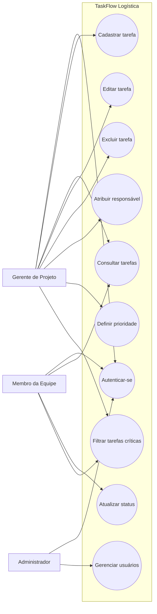
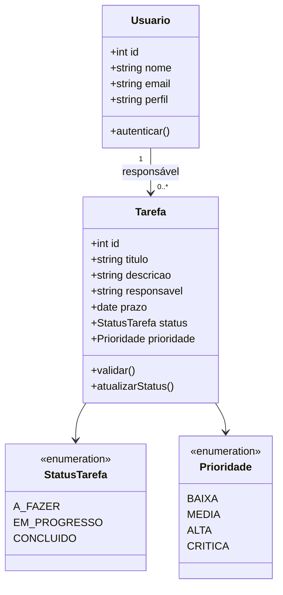

# Modelagem UML do TaskFlow Logística

## Diagrama de Casos de Uso

```mermaid
flowchart LR
    gerente[Gerente de Projeto]
    membro[Membro da Equipe]
    admin[Administrador]

    subgraph sistema[TaskFlow Logística]
        login((Autenticar-se))
        cadastrar((Cadastrar tarefa))
        consultar((Consultar tarefas))
        editar((Editar tarefa))
        excluir((Excluir tarefa))
        status((Atualizar status))
        atribuir((Atribuir responsável))
        prioridade((Definir prioridade))
        filtro((Filtrar tarefas críticas))
        usuarios((Gerenciar usuários))
    end

    gerente --> login
    gerente --> cadastrar
    gerente --> consultar
    gerente --> editar
    gerente --> excluir
    gerente --> atribuir
    gerente --> prioridade
    gerente --> filtro
    membro --> login
    membro --> consultar
    membro --> status
    membro --> filtro
    admin --> login
    admin --> usuarios
```

## Diagrama de Classes

```mermaid
classDiagram
    class Usuario {
        +int id
        +string nome
        +string email
        +string perfil
        +autenticar()
    }

    class Tarefa {
        +int id
        +string titulo
        +string descricao
        +string responsavel
        +date prazo
        +StatusTarefa status
        +Prioridade prioridade
        +validar()
        +atualizarStatus()
    }

    class StatusTarefa {
        <<enumeration>>
        A_FAZER
        EM_PROGRESSO
        CONCLUIDO
    }

    class Prioridade {
        <<enumeration>>
        BAIXA
        MEDIA
        ALTA
        CRITICA
    }

    Usuario "1" --> "0..*" Tarefa : responsável
    Tarefa --> StatusTarefa
    Tarefa --> Prioridade
```
